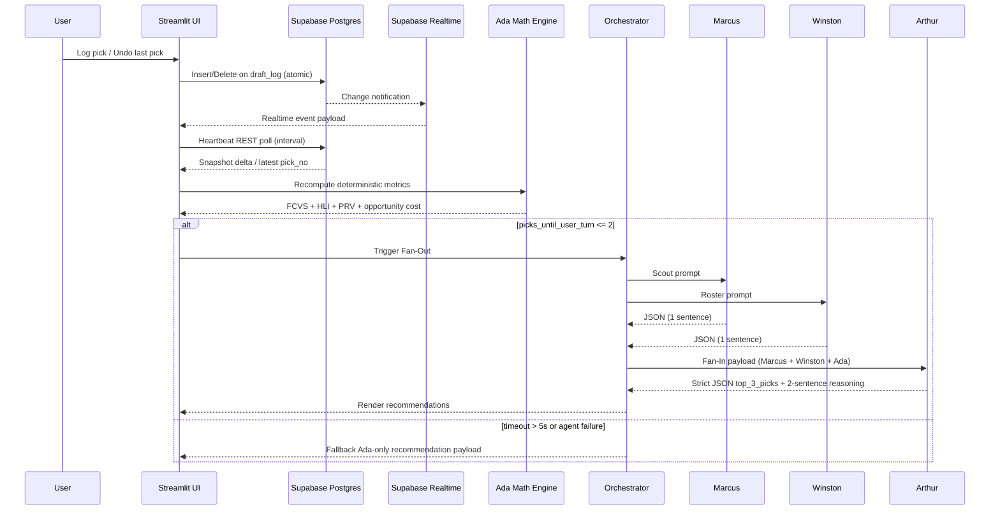

# The Best Damn Fantasy Football Drafting App - Root SSOT Specification

Status: Execution Mode (Phase 1 in progress)
Owner: Product/Engineering
Last Updated: 2026-07-28
Scope: This document is the immutable Single Source of Truth (SSOT) for architecture, data contracts, deterministic math, orchestration, and phased delivery.

## 1) Product Objective and Non-Negotiables

Build a real-time, high-throughput Fantasy Football draft assistant for live ESPN drafts with deterministic quant scoring and multi-agent synthesis.

Non-negotiables:
- Frontend is Next.js / React / Tailwind CSS (`client/`).
- Real-time updates use WebSockets over `/ws/draft` and Zustand state management.
- Interaction latency target <=2s.
- Atomic `Undo Last Pick` action must be supported.
- Database is Supabase Postgres.
- Backend API Engine is FastAPI Python server (`server/main.py`).
- League rules/scoring are seeded pre-draft via Python `espn-api` ingestion.
- Quant engine (Ada) is pure deterministic Python math (no LLM math delegation).
- Hybrid VORP/VOLS baseline, Continuous FCVS interpolation, Monte Carlo Next-Turn Opportunity Cost.
- Orchestration is Fan-Out/Fan-In multi-agent LLM debate (Marcus, Winston, Arthur).
- Hard timeout cap with 2-attempt micro-retry resilience and deterministic fallback.
- Agent outputs use contract JSON for parse safety.

## 2) System Architecture and Data Flow

### 2.1 High-Level Components

- UI Layer: Next.js React Web Dashboard (`client/`)
- API / Engine Layer: FastAPI Python Server (`server/main.py`)
- Data Layer: Supabase Postgres + Realtime + REST
- Ingestion Layer: ESPN & Multi-Source Bootstrap Service (`data/espn_ingest.py` & `services/`)
- Quant Layer: Ada deterministic engine (`engine/ada_math.py` & `engine/scoring_models.py`)
- Agent Layer: Marcus, Winston, Arthur (`agents/war_room_agents.py`)
- Orchestration Runtime: Google Antigravity / Gemini graph

### 2.2 End-to-End Sequence Mapping

1. User records pick (manual search-select + submit).
2. UI writes pick event to `draft_log` in Supabase.
3. Realtime websocket event is emitted from `draft_log` and consumed by all active clients.
4. UI updates local state and removes player from `available_players` view.
5. Heartbeat loop (REST) validates monotonic pick number and repairs drift if websocket lag/miss detected.
6. On each new pick, Ada recomputes deterministic scores:
   - Opportunity Cost
   - FCVS
   - HLI
   - PRV
7. When `picks_until_user_turn <= 2`, orchestrator executes Fan-Out:
   - Marcus call (upside sentence)
   - Winston call (roster-need sentence)
   - Ada deterministic output already available
8. Fan-In joins Marcus + Winston + Ada into Arthur input payload.
9. Arthur returns strict JSON with:
   - `reasoning_2_sentences`
   - `top_3_picks`
10. UI renders ranked recommendations and rationale.
11. If any network/model call exceeds 5 seconds, fallback path is activated:
   - Skip delayed model result(s)
   - Render Ada-only deterministic ranking with fallback rationale label.
12. If user clicks Undo Last Pick, system executes atomic rollback transaction:
   - Delete last draft_log event
   - Recompute availability and all derived metrics
   - Broadcast correction via Realtime.

### 2.3 Text Diagram (Mermaid)



## 3) Data Model and Supabase SQL DDL

All objects are in `public` schema unless stated otherwise.

### 3.1 Table: available_players

Purpose:
- Canonical draft board inventory and projections.
- Source for candidate ranking and quant calculations.

```sql
create table if not exists public.available_players (
    player_id text primary key,
    full_name text not null,
    normalized_name text not null,
    team text,
    position text not null check (position in ('QB','RB','WR','TE','K','DST')),
    bye_week smallint check (bye_week between 1 and 18),

    -- Tiering and baseline projections
    tier smallint not null check (tier >= 1),
    adp numeric(6,2),
    projection_floor numeric(7,2) not null,
    projection_median numeric(7,2) not null,
    projection_ceiling numeric(7,2) not null,

    -- Handcuff metadata
    depth_role text, -- e.g. RB1, RB2, backup
    handcuff_for_player_id text,

    -- Derived and operational fields
    is_available boolean not null default true,
    last_metric_refresh_ts timestamptz,

    -- Audit
    created_at timestamptz not null default now(),
    updated_at timestamptz not null default now()
);

create index if not exists idx_available_players_availability
    on public.available_players (is_available, position, tier);

create index if not exists idx_available_players_team_position
    on public.available_players (team, position);

create index if not exists idx_available_players_normalized_name
    on public.available_players (normalized_name);

create index if not exists idx_available_players_handcuff_for
    on public.available_players (handcuff_for_player_id);
```

### 3.2 Table: draft_log

Purpose:
- Event log of all picks and undo operations.
- Realtime trigger source.
- Single ordering truth for board state reconstruction.

```sql
create table if not exists public.draft_log (
    event_id bigint generated always as identity primary key,
    draft_id text not null,

    pick_no integer not null check (pick_no > 0),
    round_no integer not null check (round_no > 0),

    team_slot integer not null check (team_slot > 0),
    team_name text,

    player_id text not null,
    player_name text not null,
    position text not null check (position in ('QB','RB','WR','TE','K','DST')),

    picked_by_user boolean not null default false,

    -- Event typing for atomic undo support
    event_type text not null check (event_type in ('PICK','UNDO')),

    -- Optional reason/context fields
    source text not null default 'manual' check (source in ('manual','import','system')),
    notes text,

    -- Concurrency and ordering
    client_mutation_id uuid,

    created_at timestamptz not null default now()
);

-- One pick per draft slot unless explicitly undone via event semantics
create unique index if not exists uq_draft_log_draft_pick
    on public.draft_log (draft_id, pick_no)
    where event_type = 'PICK';

create index if not exists idx_draft_log_draft_created
    on public.draft_log (draft_id, created_at desc);

create index if not exists idx_draft_log_draft_round_pick
    on public.draft_log (draft_id, round_no, pick_no);

create index if not exists idx_draft_log_player
    on public.draft_log (player_id);
```

### 3.3 Optional Supporting Objects

```sql
-- Track update timestamps automatically
create or replace function public.set_updated_at()
returns trigger language plpgsql as $$
begin
  new.updated_at = now();
  return new;
end;
$$;

drop trigger if exists trg_available_players_updated_at on public.available_players;
create trigger trg_available_players_updated_at
before update on public.available_players
for each row execute function public.set_updated_at();
```

### 3.4 Supabase Realtime Configuration

Run once in SQL editor:

```sql
alter table public.draft_log replica identity full;
alter publication supabase_realtime add table public.draft_log;
```

Operational guidance:
- Subscribe to INSERT and DELETE events on `draft_log`.
- Heartbeat REST poll every 2-3 seconds while draft is active.
- If websocket sequence lag > 1 pick or stale > 6 seconds, force snapshot reconcile:
  - pull latest `draft_log` rows by `draft_id`
  - recompute available set and local cache.

### 3.4 7-Source Blended Data Pipeline & Feed Control Specification

The platform ingests, normalizes, and blends seven complementary market consensus and sharp quantitative data feeds:

1. 🏈 **ESPN Platform Baseline** ([`espn_ingest.py`](file:///C:/Code/FF-War-Room/data/espn_ingest.py)): Direct league settings, team rosters, position eligibility, and baseline projection medians.
2. 📈 **Sleeper ADP API** ([`sleeper_client.py`](file:///C:/Code/FF-War-Room/services/sleeper_client.py)): Live Sleeper public player database rankings (`search_rank` across 12,000+ players).
3. 🎯 **FantasyPros Consensus ECR** ([`fantasypros_client.py`](file:///C:/Code/FF-War-Room/services/fantasypros_client.py)): Expert Consensus Rankings, analyst tier breaks, and standard deviation spread.
4. ⚡ **Underdog High-Stakes ADP** ([`underdog_client.py`](file:///C:/Code/FF-War-Room/services/underdog_client.py)): Real-money best-ball draft ADP reflecting sharp high-stakes market sentiment.
5. 🎲 **Vegas Sportsbook Props** ([`vegas_odds_client.py`](file:///C:/Code/FF-War-Room/services/vegas_odds_client.py)): Implied fantasy points derived from season-long Passing, Rushing, and Receiving Over/Under yardage and touchdown prop lines.
6. 🔬 **High-Stakes Analytical Projections** ([`premium_analytics_client.py`](file:///C:/Code/FF-War-Room/services/premium_analytics_client.py)): Sharp projection baselines (ETR, 4for4, PFF).
7. 📊 **Advanced Opportunity Metrics** ([`premium_analytics_client.py`](file:///C:/Code/FF-War-Room/services/premium_analytics_client.py)): Air Yards Share, Target Share, Expected Fantasy Points (xFP), Offensive Line Tier ratings, and Pass Rate Over Expected (PROE).

#### Data Source Toggles & Live Feed Audit
- **Interactive Toggles**: Users can toggle any source feed on or off in the ESPN Settings Modal ([`ESPNSyncModal.tsx`](file:///C:/Code/FF-War-Room/client/components/ESPNSyncModal.tsx) and [`ui/app.py`](file:///C:/Code/FF-War-Room/ui/app.py)).
- **Live Feed Audit Breakdown**: The sync payload returns a structured `feed_status` map rendering live status badges (`🟢 OK`, `⚪ OFF`, `⚠️ Failed`) with matched player counts directly in the UI modal.

## 4) Deterministic Quant Engine (Ada) Logic

### 4.1 Inputs

- Current round, overall pick number, and upcoming picks window.
- Remaining player pool from `available_players` where `is_available = true`.
- Roster composition by team and by user.
- Tier boundaries by position.
- Recent draft window (last 10 picks).
- Blended projections from active 7-source multi-source feeds.

### 4.2 Opportunity Cost (OC)

Define for a candidate player p at position pos:

- Let `best_now(pos)` be top score available now at position.
- Let `expected_best_at_next_turn(pos)` estimate top score likely remaining at user's next pick.

Formula:

OC(p) = value_now(p) - expected_best_at_next_turn(pos(p))

Interpretation:
- Higher OC means passing now is expensive.
- OC should be normalized to z-score within candidate shortlist for comparability.

### 4.3 FCVS (Floor-to-Ceiling Variance Shift)

Base player components:
- floor = projection_floor
- ceiling = projection_ceiling

Round-dependent weights:
- Rounds 1-5: 80% floor, 20% ceiling
- Rounds 6-9: 50% floor, 50% ceiling
- Rounds 10+: 10% floor, 90% ceiling

Piecewise weighting:

If round in [1,5]:
FCVS_raw = 0.80 * floor + 0.20 * ceiling

If round in [6,9]:
FCVS_raw = 0.50 * floor + 0.50 * ceiling

If round >= 10:
FCVS_raw = 0.10 * floor + 0.90 * ceiling

Normalization recommendation:
- Min-max or z-score by position to avoid position baseline distortion.

### 4.4 HLI (Handcuff Leverage Index)

Purpose:
- Reward strategic backup acquisition for own RB1 protection and opponent denial.

Given backup candidate b:

- If b is direct backup to user's own RB1 -> multiplier = 1.5
- Else if b backs up opponent unhandcuffed RB1 -> multiplier = 1.3
- Else if b is unowned low-tier backup -> multiplier = 0.5
- Else multiplier = 1.0

HLI(b) = base_backup_value(b) * multiplier

Where `base_backup_value` can be derived from median projection + contingent upside factor.

### 4.5 PRV (Positional Run Velocity)

Window:
- Rolling last 10 picks.

Trigger conditions:
- Position share in window > 40%
- AND imminent tier cliff detected for that position

Definitions:
- run_share(pos) = picks_of_pos_last_10 / 10
- trigger(pos) = (run_share(pos) > 0.40) and (tier_cliff_imminent(pos) = true)

PRV boost guidance:
- Apply urgency boost multiplier to candidates in triggered position.
- Suggested multiplier range: 1.05 to 1.20 based on cliff severity.

### 4.6 Composite Ranking Score

Suggested deterministic composite:

score(p) = w1*OC_norm + w2*FCVS_norm + w3*HLI_norm + w4*PRV_norm + w5*RosterFit

Default start weights (tunable):
- w1 = 0.30
- w2 = 0.25
- w3 = 0.20
- w4 = 0.15
- w5 = 0.10

Rules:
- All terms deterministic and auditable.
- No stochastic ranking in production mode.
- Persist top candidate table each pick for reproducibility.

## 5) Agent Contracts, System Prompts, and JSON Schemas

All agent outputs must be strict JSON with no markdown and no extra keys.

### 5.1 Shared Runtime Contract

- Hard timeout per model call: 5 seconds.
- Retry budget: 0 in live critical path (favor fallback speed).
- Parse mode: strict JSON schema validation.
- On validation failure: treat as timeout/failure and continue fallback flow.

### 5.2 Marcus (Chief Scout)

Role:
- Fast mini model with retrieval over injury/camp/news vector context.
- Must output exactly one sentence focused only on upside talent.

System prompt:

```text
You are Marcus, Chief Scout for a fantasy football draft war room.
Task: Produce exactly one sentence evaluating upside talent for ONE candidate player.
Constraints:
- Use only provided context and player attributes.
- Focus on upside pathways (athletic profile, role expansion, camp/injury news impact).
- Do not discuss roster construction, bye week strategy, or math scores.
- Output must be strict JSON only, no markdown.
- Return exactly the keys required by schema and no extras.
```

Marcus JSON Schema:

```json
{
  "$schema": "https://json-schema.org/draft/2020-12/schema",
  "title": "MarcusOutput",
  "type": "object",
  "additionalProperties": false,
  "required": ["agent", "player_id", "upside_sentence"],
  "properties": {
    "agent": { "const": "Marcus" },
    "player_id": { "type": "string", "minLength": 1 },
    "upside_sentence": {
      "type": "string",
      "minLength": 10,
      "maxLength": 280,
      "pattern": "^[^.?!]+[.?!]$"
    }
  }
}
```

### 5.3 Winston (Roster Architect)

Role:
- Specialized reasoning model for structural roster needs.
- Must output exactly one sentence focused only on positional need/synergy.

System prompt:

```text
You are Winston, Roster Architect for a fantasy football draft war room.
Task: Produce exactly one sentence evaluating roster fit and positional need for ONE candidate player.
Constraints:
- Use only provided roster state, bye weeks, and positional scarcity context.
- Focus on structural needs and synergy with current roster.
- Do not discuss raw upside scouting narratives or deterministic math details.
- Output must be strict JSON only, no markdown.
- Return exactly the keys required by schema and no extras.
```

Winston JSON Schema:

```json
{
  "$schema": "https://json-schema.org/draft/2020-12/schema",
  "title": "WinstonOutput",
  "type": "object",
  "additionalProperties": false,
  "required": ["agent", "player_id", "need_sentence"],
  "properties": {
    "agent": { "const": "Winston" },
    "player_id": { "type": "string", "minLength": 1 },
    "need_sentence": {
      "type": "string",
      "minLength": 10,
      "maxLength": 280,
      "pattern": "^[^.?!]+[.?!]$"
    }
  }
}
```

### 5.4 Arthur (General Manager)

Role:
- Frontier reasoning model.
- Input: Marcus outputs, Winston outputs, Ada deterministic scores.
- Output: strict JSON with exactly two reasoning sentences and top 3 picks.

System prompt:

```text
You are Arthur, General Manager for a fantasy football draft war room.
You must synthesize:
1) Marcus upside sentence(s),
2) Winston roster-need sentence(s),
3) Ada deterministic ranking metrics.

Decision policy:
- Respect Ada deterministic ranking as primary anchor.
- Use Marcus/Winston only as tie-breakers or confidence modifiers.
- If supplied context is conflicting, prefer deterministic risk-controlled choice.

Output constraints:
- Output strict JSON only, no markdown.
- reasoning_2_sentences must contain exactly two sentences.
- top_3_picks must contain exactly 3 ranked players.
- No additional keys.
```

Arthur JSON Schema:

```json
{
  "$schema": "https://json-schema.org/draft/2020-12/schema",
  "title": "ArthurOutput",
  "type": "object",
  "additionalProperties": false,
  "required": ["agent", "reasoning_2_sentences", "top_3_picks"],
  "properties": {
    "agent": { "const": "Arthur" },
    "reasoning_2_sentences": {
      "type": "string",
      "minLength": 20,
      "maxLength": 500,
      "pattern": "^([^.!?]+[.!?]\s+){1}[^.!?]+[.!?]$"
    },
    "top_3_picks": {
      "type": "array",
      "minItems": 3,
      "maxItems": 3,
      "items": {
        "type": "object",
        "additionalProperties": false,
        "required": ["rank", "player_id", "player_name", "position", "composite_score"],
        "properties": {
          "rank": { "type": "integer", "enum": [1, 2, 3] },
          "player_id": { "type": "string", "minLength": 1 },
          "player_name": { "type": "string", "minLength": 1 },
          "position": { "type": "string", "enum": ["QB", "RB", "WR", "TE", "K", "DST"] },
          "composite_score": { "type": "number" }
        }
      }
    },
    "fallback_used": { "type": "boolean", "default": false }
  }
}
```

Note:
- If `fallback_used` is retained, include it in `required` and all consumers; otherwise remove it from schema and payload contract. Current recommendation: include it for observability.

### 5.5 Multi-Source Metric Context Injection into Agent Prompts

The War Room Orchestrator ([`agents/war_room_agents.py`](file:///C:/Code/FF-War-Room/agents/war_room_agents.py)) dynamically injects multi-source metrics into each agent prompt during live deliberations:
- **Marcus (Chief Scout)** receives: Active Feeds list, Real-Money Underdog ADP, Vegas Sportsbook Implied Points, High-Stakes Projections (ETR/PFF), Air Yards Share, Target Share, and Expected Fantasy Points (xFP).
- **Winston (Roster Architect)** receives: Current roster composition by position, unfilled starting requirements, player Bye week, and roster Bye week overlaps.
- **Arthur (General Manager)** receives: Marcus scout notes, Winston roster notes, and Ada's quantitative composite candidates with Vegas implied points, Underdog ADP, and xFP metrics.

## 6) Web Client & Frontend Application Architecture (`client/`)

### 6.1 State Management (Zustand Store: `useDraftStore.ts`)

- `draftState`: Full draft board, picks, available players, and rosters.
- `adaRankings`: Live candidate rankings from Ada quant engine.
- `agentAdvisories`: Multi-agent synthesis output (Marcus, Winston, Arthur).
- `isDeliberating`: Boolean loading state for live AI agent debate.
- `activeModal`: ESPN sync modal and feed settings modal state.
- `feedStatus`: Live multi-source data feed health (`🟢 OK`, `⚪ OFF`, `⚠️ Failed`).

### 6.2 Component Architecture

- `HeaderBar.tsx`: System header, connectivity indicators, feed status audit modal button.
- `PickInput.tsx`: Real-time player searchbox and pick entry/undo controls.
- `AdaRecommendations.tsx`: Quantitative rank cards with composite breakdown metrics.
- `AgentAdvisoryPanel.tsx`: Marcus, Winston, and Arthur multi-agent debate cards.
- `FullDraftGrid.tsx`: Interactive full draft grid board with pick status.
- `RosterGrid.tsx`: User roster tracking panel.
- `ESPNSyncModal.tsx`: Live ESPN credentials sync modal and data source toggles.

### 6.3 Real-Time WebSocket Communication (`/ws/draft`)

- React client maintains an active WebSocket connection to FastAPI backend (`/ws/draft`).
- Broadcast events: `DRAFT_UPDATED`, `DEBATE_COMPLETED`, `SYNC_COMPLETED`, `PICK_UNDONE`.
- Reconnect handler re-syncs state automatically on connection recovery.

### 6.4 Undo Last Pick (Atomicity Rules)

- Undo must target latest effective PICK event for active draft.
- Execute as transaction semantics in backend service layer.
- Post-undo must recompute:
  - `available_players.is_available`
  - round/pick derived state
  - Ada scores
- Broadcast correction via Realtime and force local reconcile.

## 7) Orchestration Behavior and Timeout Policy

Trigger:
- If picks until user turn <= 2.

Fan-Out:
- Parallel calls to Marcus and Winston.

Fan-In:
- Combine both outputs with Ada deterministic table.
- Send consolidated context to Arthur.

Timeout:
- 5 seconds hard cap per external model/network call.

Fallback:
- If any critical call fails or times out, render Ada-only recommendation packet with `fallback_mode=true`.
- Preserve UI continuity; never block draft board updates for agent delay.

## 8) Proposed Repository Structure

```text
FF-War-Room/
  WAR_ROOM_SPEC.md
  README.md
  requirements.txt
  .env.example

  config/
    settings.py
    logging.yaml

  data/
    espn_ingest.py
    seed/
      sample_players.csv

  db/
    supabase_schema.sql
    migrations/
      001_init_tables.sql
      002_indexes_realtime.sql

  engine/
    ada_math.py
    scoring_models.py
    tier_cliff.py

  agents/
    war_room_agents.py
    prompts/
      marcus_system.txt
      winston_system.txt
      arthur_system.txt
    schemas/
      marcus_output.schema.json
      winston_output.schema.json
      arthur_output.schema.json

  ui/
    app.py
    components/
      draft_board.py
      recommendations.py
      connectivity_status.py

  services/
    supabase_client.py
    realtime_listener.py
    heartbeat.py
    draft_state_service.py

  tests/
    test_ada_math.py
    test_prv_detection.py
    test_hli_logic.py
    test_draft_log_undo.py
    test_agent_schema_validation.py

  docs/
    HISTORY.md
    architecture_decisions/
      ADR-001-realtime-strategy.md
      ADR-002-timeout-fallback-policy.md
```

## 9) Four-Phase Delivery Roadmap

### Phase 1: Supabase Setup and ESPN Ingestion

Checklist:
- Create Supabase project and capture env vars.
- Apply `available_players` + `draft_log` DDL.
- Configure Realtime publication and replica identity.
- Implement ESPN ingestion script to pull:
  - league settings
  - scoring multipliers
  - roster rules
  - initial player pool/projections mapping
- Normalize names and IDs into canonical `player_id` keys.
- Seed `available_players` and validate row counts.
- Build dry-run validation report (missing fields, duplicates, bad positions).
- Add ingestion idempotency guard (upsert by `player_id`).

Exit criteria:
- Supabase tables populated and queryable.
- Realtime emits for manual insert on `draft_log`.
- Ingestion can be rerun safely without duplicate logical players.

### Phase 2: Python Quant Engine (`ada_math.py`)

Checklist:
- Implement deterministic functions for OC, FCVS, HLI, PRV.
- Add position-aware normalization strategy.
- Add tier cliff detector for PRV trigger.
- Implement composite scoring with configurable weights.
- Store per-pick scoring snapshot for replay/audit.
- Write unit tests for all formulas and edge cases.

Exit criteria:
- Deterministic ranking reproducible from same draft state.
- Unit tests pass for all primary math branches.

### Phase 3: Streamlit Clone Board UI (`app.py`)

Checklist:
- Build draft board, player searchbox, and recommendation panel.
- Implement atomic Undo Last Pick control.
- Integrate realtime listener + heartbeat reconciliation.
- Implement fragment boundaries for low-latency partial rerender.
- Add degraded/fallback mode status chips.

Exit criteria:
- End-to-end local run supports live pick logging and instant recompute.
- Undo works and state converges correctly after reconnects.

### Phase 4: Agent Orchestration and Fallbacks (`war_room_agents.py`)

Checklist:
- Build Fan-Out/Fan-In graph in Antigravity/OpenRouter.
- Enforce strict schema validation per agent.
- Add 5-second hard timeouts and deterministic fallback.
- Add observability logs: latency, timeout counts, fallback rate.
- Add integration tests with mocked provider responses.

Exit criteria:
- Recommendations render within live draft constraints.
- Timeout/failure path never blocks deterministic board updates.

## 10) Operational and Reliability Guardrails

- Prioritize eventual consistency + fast recovery over perfect websocket continuity.
- Keep deterministic engine as always-available baseline.
- Never allow LLM failure to break core recommendation rendering.
- Log all recommendation payloads with draft state hash for postmortem analysis.
- Keep all schema contracts versioned; breaking changes require explicit version bump.

## 11) Immediate Next Step (Approval Gate)

All four implementation phases (Phase 1 through Phase 4) and the Championship Enhancement Roadmap (Sprints 1-4) have been completed and verified as of 2026-08-05.
The Fantasy Football AI War Room system is fully operational.

## 12) Implementation Status Log (Historical Tracking)

### 2026-08-05 - Championship Enhancement Roadmap Completed (Sprints 1-4)
- **Sprint 1**: Implemented VOR calculations, auto-detected scoring formats (PPR/Half-PPR), position-specific projection variance, and rendering of Bye/Injury warning badges.
- **Sprint 2**: Implemented scarcity-aware RosterFit gradients, multi-tiered PRV cliffs, and contextualized Agent System Prompts with injury/bye data.
- **Sprint 3**: Built the "My Roster" tracking panel in `ui/app.py`, created ADP Arbitrage value badges (`STEAL`, `Reach`), and developed Ada-Ranked HTML/CSV cheat sheet exports.
- **Sprint 4**: Added primary NFL RB handcuff mapping to ESPN ingestion, and dynamically redistributed HLI weight for non-RB positions in the Ada math engine. All 35 tests passing.

### 2026-08-05 - Phase 4 Agent Orchestration Completed and Verified

Comments:
- Implemented Multi-Agent Orchestration Graph (`agents/war_room_agents.py`): Marcus (Chief Scout), Winston (Roster Architect), Arthur (GM).
- Implemented parallel Fan-Out / Fan-In with strict 5.0-second timeout cap.
- Enforced JSON schema validation against `agents/schemas/`.
- Implemented deterministic Ada-only fallback mechanics.
- All 22 unit tests across `tests/` passed cleanly.

Phase 4 artifact status:
- Created standalone `phase-4-checklist.md`.
- Integrated agent synthesis UI rendering into `ui/components/recommendations.py`.
- Integrated orchestrator trigger into `ui/app.py`.

### 2026-07-28 - Planning Approved and Execution Started

Comments:
- Planning SSOT approved as authoritative baseline.
- Repository scaffold created to match Section 8 structure.
- No Phase 2 work started; strict phase gate remains active.

Phase 1 artifact status:
- Created `.env.example` with Supabase, OpenRouter, and ESPN cookie placeholders.
- Added SQL migrations:
  - `db/migrations/001_init_tables.sql`
  - `db/migrations/002_indexes_realtime.sql`
- Added initial ESPN ingestion script:
  - `data/espn_ingest.py`
  - Supports env-based auth, scoring snapshot extraction, player normalization,
    validation report output, and optional Supabase upsert.


Open items before Phase 1 sign-off:
- User-provided ESPN league identifiers and auth cookies required for live ingest run.
- User-provided Supabase credentials required for non-dry-run upsert verification.
- Realtime verification against a live Supabase project pending user test cycle.
