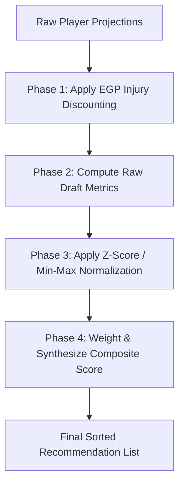

# Ada Quant Engine: Complete Technical Architecture & Scoring Logic

This document provides a exhaustive mathematical and logical breakdown of the **Ada Quant Engine** used for player evaluation and draft recommendations. It details every metric, normalization step, weight, multiplier, and edge-case handling, designed to allow other AI models or systems to fully audit, replicate, or evaluate drafting strategies.

---

## Table of Contents
1. [Core Philosophy & Execution Flow](#1-core-philosophy--execution-flow)
2. [Phase 1: Pre-Processing & Injury Discounting (EGP)](#2-phase-1-pre-processing--injury-discounting-egp)
3. [Phase 2: Raw Metric Computation](#3-phase-2-raw-metric-computation)
    * [Opportunity Cost (OC)](#opportunity-cost-oc)
    * [Value Over Replacement (VOR)](#value-over-replacement-vor)
    * [Floor-to-Ceiling Variance Shift (FCVS)](#floor-to-ceiling-variance-shift-fcvs)
    * [Handcuff Leverage Index (HLI)](#handcuff-leverage-index-hli)
    * [Roster Fit (RFIT)](#roster-fit-rfit)
    * [Positional Run Velocity (PRV)](#positional-run-velocity-prv)
4. [Phase 3: Normalization Algorithms](#4-phase-3-normalization-algorithms)
5. [Phase 4: Multi-Agent Synthesis & Final Composite Score](#5-phase-4-multi-agent-synthesis--final-composite-score)
6. [Dynamic Starter & Scarcity Calculations (FLEX & SUPERFLEX)](#6-dynamic-starter--scarcity-calculations-flex--superflex)

---

## 1. Core Philosophy & Execution Flow

The Ada Quant Engine operates on a **deterministic pipeline**. Given the current draft log, the available player pool, roster requirements, and the user's draft slot, the engine will compute the exact same recommendations every time. 

The evaluation pipeline follows these consecutive stages:

---

## 2. Phase 1: Pre-Processing & Injury Discounting (EGP)

Before any draft metrics are computed, raw projected median points are adjusted using the **Expected Games Played (EGP)** multiplier. This discounting ensures that injured or suspended players do not artificially inflate value statistics.

### Formula
$$P_{\text{adjusted}} = P_{\text{median}} \times M_{\text{injury}}$$

Where the injury multiplier $M_{\text{injury}}$ is defined as:

| Injury Status | Multiplier ($M_{\text{injury}}$) | Notes / Severity |
| :--- | :--- | :--- |
| **ACTIVE** | $1.00$ | Fully healthy or minor knick |
| **QUESTIONABLE** | $0.95$ | Day-to-day, minor risk |
| **DOUBTFUL** | $0.88$ | High probability of missing initial game(s) |
| **OUT** | $0.82$ | Multi-week injury recovery |
| **PUP** (Physically Unable to Perform) | $0.75$ | Expected to miss at least 4 games |
| **IR** (Injury Reserve / Suspension) | $0.70$ | Severe long-term absence |

---

## 3. Phase 2: Raw Metric Computation

Once projections are adjusted for injury risk, the engine calculates six raw draft-specific metrics for each player.

---

### Opportunity Cost (OC)
Opportunity Cost represents the projected points lost at a position if the user passes on a player and waits to address that position in the next round.

#### Step 1: Simulating Board Run
To find the expected player remaining at the user's next turn, the engine simulates drafting the next $D$ players (where $D = \text{picks\_until\_next\_turn}$) sorted by consensus ADP:
$$D = \text{picks\_until\_next\_turn}$$

#### Step 2: Counting Expected Position Drop
The engine count how many players of the target candidate's position ($position$) are drafted in that simulation ($k$):
$$k = \sum_{p \in \text{simulated\_drafted}} 1 \quad \text{where } \text{pos}(p) = position$$

#### Step 3: Extract Next Best
The engine isolates all remaining available players of that position, sorts them by $P_{\text{adjusted}}$ descending, and identifies the $(k+1)$-th player's projection as the baseline ($P_{\text{expected\_best}}$):
$$P_{\text{expected\_best}} = \text{Projection of } (k+1)\text{-th best player at position } position$$

#### Step 4: Calculate Raw OC
$$\text{OC}_{\text{raw}} = P_{\text{adjusted}} - P_{\text{expected\_best}}$$

---

### Value Over Replacement (VOR)
VOR measures a player's value over a baseline replacement-level player. 

#### Step 1: Determining Effective Starters
Effective starters are computed by distributing FLEX and SUPERFLEX slots dynamically (see [Section 6](#6-dynamic-starter--scarcity-calculations-flex--superflex) for details).

#### Step 2: Baseline Index
The replacement baseline index for a position is calculated as:
$$I_{\text{replacement}} = \max(0, (\text{num\_teams} \times S_{\text{effective}}) - N_{\text{drafted}})$$

Where:
*   $S_{\text{effective}}$ is the effective starters required at that position.
*   $N_{\text{drafted}}$ is the total number of players already drafted at that position across all teams.

#### Step 3: Replacement Baseline Player
The available players at the position are sorted by $P_{\text{adjusted}}$ descending. The projection of the player at index $I_{\text{replacement}}$ is set as $P_{\text{replacement}}$.

#### Step 4: Calculate Raw VOR
$$\text{VOR}_{\text{raw}} = P_{\text{adjusted}} - P_{\text{replacement}}$$

---

### Floor-to-Ceiling Variance Shift (FCVS)
FCVS adjusts player evaluations based on draft maturity (current round). Early rounds emphasize safety (floor), while late rounds prioritize ceiling.

#### Step 1: Round-Based Weights
The floor weight ($w_{\text{floor}}$) decays linearly from $0.90$ down to a minimum of $0.10$ as the draft progresses:
$$w_{\text{floor}} = \max(0.10, 0.90 - 0.08 \times (\text{round\_no} - 1))$$
$$w_{\text{ceiling}} = 1.0 - w_{\text{floor}}$$

#### Step 2: Projection Fallbacks (If Floor/Ceiling data is missing)
If explicit floor or ceiling data is unavailable, position-specific modifiers are applied to the adjusted median:

| Position | Floor Modifier ($M_{\text{floor}}$) | Ceiling Modifier ($M_{\text{ceiling}}$) |
| :--- | :--- | :--- |
| **QB** | $0.88$ | $1.12$ |
| **RB** | $0.75$ | $1.30$ |
| **WR** | $0.78$ | $1.28$ |
| **TE** | $0.72$ | $1.35$ |
| **K** | $0.80$ | $1.20$ |
| **DST** | $0.70$ | $1.40$ |
| **Default (Others)** | $0.85$ | $1.15$ |

$$P_{\text{floor}} = \max(0.0, P_{\text{adjusted}} \times M_{\text{floor}})$$
$$P_{\text{ceiling}} = \max(P_{\text{adjusted}}, P_{\text{adjusted}} \times M_{\text{ceiling}})$$

#### Step 3: Calculate Raw FCVS
$$\text{FCVS}_{\text{raw}} = (w_{\text{floor}} \times P_{\text{floor}}) + (w_{\text{ceiling}} \times P_{\text{ceiling}})$$

---

### Handcuff Leverage Index (HLI)
Active only for Running Backs ($position = \text{RB}$). For all other positions, $\text{HLI}_{\text{raw}} = 0.0$.

HLI rewards backup running backs who possess significant safety or sabotage value:

*   **Rule A (User Handcuff):** If the candidate RB is the direct backup or primary handcuff to the **User's** RB1:
    $$\text{HLI}_{\text{raw}} = P_{\text{adjusted}} \times 1.50$$
*   **Rule B (Opponent Handcuff Sabotage):** If the candidate RB is the backup to an **Opponent's** RB1, and that opponent has **not** drafted their backup handcuff yet:
    $$\text{HLI}_{\text{raw}} = P_{\text{adjusted}} \times 1.30$$
*   **Rule C (Low-Tier Backup Penalty):** If the candidate RB is low depth (RB3/RB4/Reserve) and has a projection under 50.0 points:
    $$\text{HLI}_{\text{raw}} = P_{\text{adjusted}} \times 0.50$$
*   **Rule D (Default):**
    $$\text{HLI}_{\text{raw}} = P_{\text{adjusted}} \times 1.00$$

---

### Roster Fit (RFIT)
Calculates a multiplier based on the user's roster needs and positional scarcity.

#### Step 1: Determine open slots
The engine computes starting slots needed ($N_{\text{needed}}$) by comparing current owned players at the position ($N_{\text{owned}}$) to the required starters ($R_{\text{starters}}$). It also tracks unassigned FLEX and SUPERFLEX slots they can fill.

#### Step 2: Scarcity Check
The engine counts how many players of that position remain available in the player pool ($A_{\text{position}}$).

#### Step 3: Multiplier Thresholds

*   **High Need ($N_{\text{needed}} \ge 2$):**
    $$\text{RFIT} = 1.50$$
*   **Moderate Need ($N_{\text{needed}} = 1$):**
    *   If scarce ($A_{\text{position}} \le 15$): $\text{RFIT} = 1.40$
    *   If moderate ($A_{\text{position}} \le 30$): $\text{RFIT} = 1.20$
    *   Else: $\text{RFIT} = 1.10$
*   **Flex-Only Fit ($N_{\text{needed}} = 0$ but FLEX/SUPERFLEX slots are open):**
    *   If position is **QB** and SUPERFLEX is open:
        *   If scarce ($A_{\text{position}} \le 20$): $\text{RFIT} = 1.35$
        *   Else: $\text{RFIT} = 1.15$
    *   If position is **RB/WR/TE** and FLEX is open:
        *   $\text{RFIT} = 1.00$
*   **Roster Overfill (No open starter or flex slots for this position):**
    *   If early draft ($\text{round\_no} \le 6$): $\text{RFIT} = 0.60$ (strongly discourages benching early)
    *   If late draft ($\text{round\_no} > 6$): $\text{RFIT} = 0.80$
*   **Special Suppression (K & DST):**
    *   If position is **K** or **DST** and $\text{round\_no} < 10$: $\text{RFIT} = 0.30$

---

### Positional Run Velocity (PRV)
PRV detects runs on a position and increases the urgency to draft that position before a drop-off occurs.

#### Step 1: Run Share
Calculates the fraction of the position drafted in a rolling window of the last 10 picks ($W$):
$$\text{RunShare} = \frac{\sum_{p \in W} 1 \quad \text{where } \text{pos}(p) = position}{10}$$

#### Step 2: Tier Cliff Detection
Identifies the top remaining tier for the position, and counts how many players are left in that tier ($T_{\text{left}}$).

#### Step 3: Urgency Boost Multiplier
The PRV multiplier is returned based on the following gradient matrix:

| $T_{\text{left}}$ (Players Left in Tier) | $\text{RunShare}$ Threshold | PRV Multiplier |
| :--- | :--- | :--- |
| **$1$ player** | $> 0.30$ | **$1.25$** |
| **$2$ players** | $> 0.30$ | **$1.18$** |
| **$3$ players** | $> 0.35$ | **$1.12$** |
| **$4$ to $5$ players** | $> 0.40$ | **$1.06$** |
| **All other states** | — | **$1.00$** |

---

## 4. Phase 3: Normalization Algorithms

To combine these raw metrics (some measured in points, others in multipliers), the engine normalizes them into equivalent mathematical ranges.

### Z-Score Normalization (Used for OC, VOR, RosterFit)
Z-Score normalizes values to have a mean of $0$ and standard deviation of $1$, preserving relative valuation gaps:

$$\mu = \frac{1}{n} \sum_{i=1}^{n} x_i$$
$$\sigma = \sqrt{\frac{1}{n} \sum_{i=1}^{n} (x_i - \mu)^2}$$
$$z_i = \frac{x_i - \mu}{\sigma}$$

*Edge Case: If $\sigma < 1e-9$, the engine returns $0.0$ for all elements.*

### Min-Max Normalization (Used for FCVS, HLI, PRV)
Min-Max normalizes values to fit strictly within a $[0.0, 1.0]$ range:

$$m_i = \frac{x_i - \min(x)}{\max(x) - \min(x)}$$

*Edge Case: If $\max(x) - \min(x) < 1e-9$, the engine returns $0.5$ for all elements.*

---

## 5. Phase 4: Multi-Agent Synthesis & Final Composite Score

Using the normalized values, a base composite score is compiled.

$$\text{Base Sum} = (w_{oc} \cdot \text{OC}_{\text{norm}}) + (w_{vor} \cdot \text{VOR}_{\text{norm}}) + (w_{fcvs} \cdot \text{FCVS}_{\text{norm}}) + (w_{hli} \cdot \text{HLI}_{\text{norm}}) + (w_{prv} \cdot \text{PRV}_{\text{norm}}) + (w_{rfit} \cdot \text{RosterFit}_{\text{norm}})$$

### Running Back Handcuff Scaling
If a candidate is a Running Back, the raw HLI adjustment is applied to scale their final Composite Score:

$$\text{HLI\_mult} = \begin{cases} 
\frac{\text{HLI}_{\text{raw}}}{P_{\text{adjusted}}} & \text{if } P_{\text{adjusted}} > 0 \\
1.0 & \text{otherwise}
\end{cases}$$

$$\text{Composite Score} = \text{Base Sum} \times \text{HLI\_mult}$$

*For non-RBs, $\text{HLI\_mult} = 1.0$.*

---

## 6. Dynamic Starter & Scarcity Calculations (FLEX & SUPERFLEX)

To ensure the engine behaves optimally in leagues with FLEX and SUPERFLEX slots, the baseline calculations are adjusted:

### Effective Starters
Effective starters required per position are calculated by fractionally distributing the FLEX and SUPERFLEX slots based on historical draft patterns:

$$S_{\text{effective}}(pos) = R_{\text{starters}}(pos) + \left(\text{FLEX} \times W_{\text{FLEX}}(pos)\right) + \left(\text{SUPERFLEX} \times W_{\text{SUPERFLEX}}(pos)\right)$$

Where the weights are defined as:

*   **FLEX weights ($W_{\text{FLEX}}$):** 
    *   $\text{RB} = 0.45$
    *   $\text{WR} = 0.35$
    *   $\text{TE} = 0.20$
*   **SUPERFLEX weights ($W_{\text{SUPERFLEX}}$):**
    *   $\text{QB} = 1.00$
    *   $\text{RB/WR/TE} = 0.00$ (reflects the strategy that QB is the optimal choice in Superflex)

### Example Calculation
In a 12-team league with roster requirements: `{QB: 1, RB: 2, WR: 2, TE: 1, FLEX: 1, SUPERFLEX: 1, DST: 1}`:

*   **QB effective starters:** $1.0 \text{ (base)} + 1.0 \times 1.0 \text{ (SUPERFLEX)} = \mathbf{2.0}$
    *   *Total league QB demand:* $12 \times 2.0 = \mathbf{24 \text{ QBs}}$
*   **RB effective starters:** $2.0 \text{ (base)} + 1.0 \times 0.45 \text{ (FLEX)} = \mathbf{2.45}$
    *   *Total league RB demand:* $12 \times 2.45 = \mathbf{29.4 \text{ RBs}}$
*   **WR effective starters:** $2.0 \text{ (base)} + 1.0 \times 0.35 \text{ (FLEX)} = \mathbf{2.35}$
    *   *Total league WR demand:* $12 \times 2.35 = \mathbf{28.2 \text{ WRs}}$
*   **TE effective starters:** $1.0 \text{ (base)} + 1.0 \times 0.20 \text{ (FLEX)} = \mathbf{1.20}$
    *   *Total league TE demand:* $12 \times 1.20 = \mathbf{14.4 \text{ TEs}}$

This dynamic calculation ensures that replacement lines and opportunity costs shift to match the constraints of your league settings.
